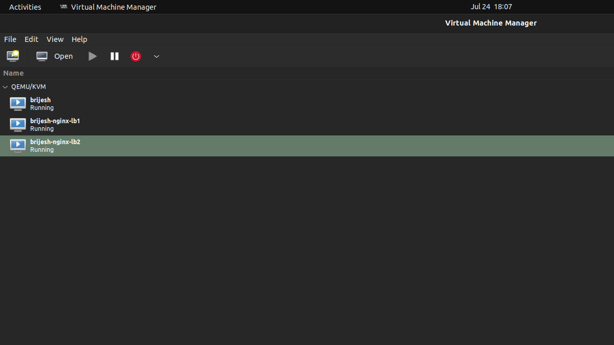
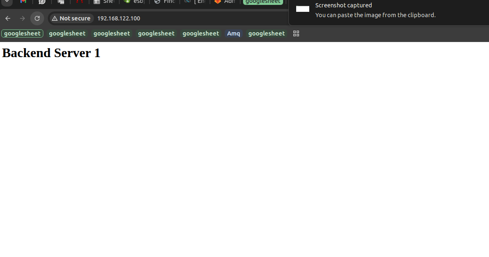
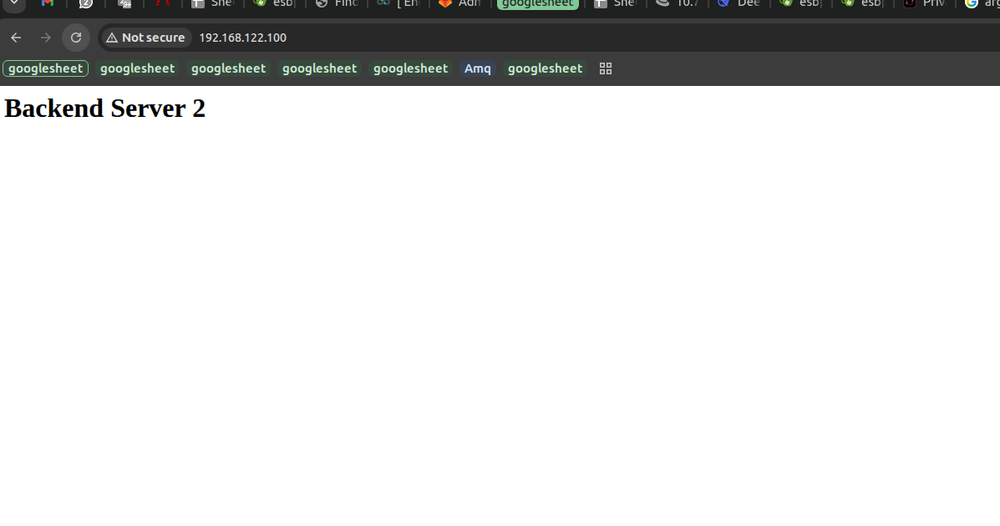
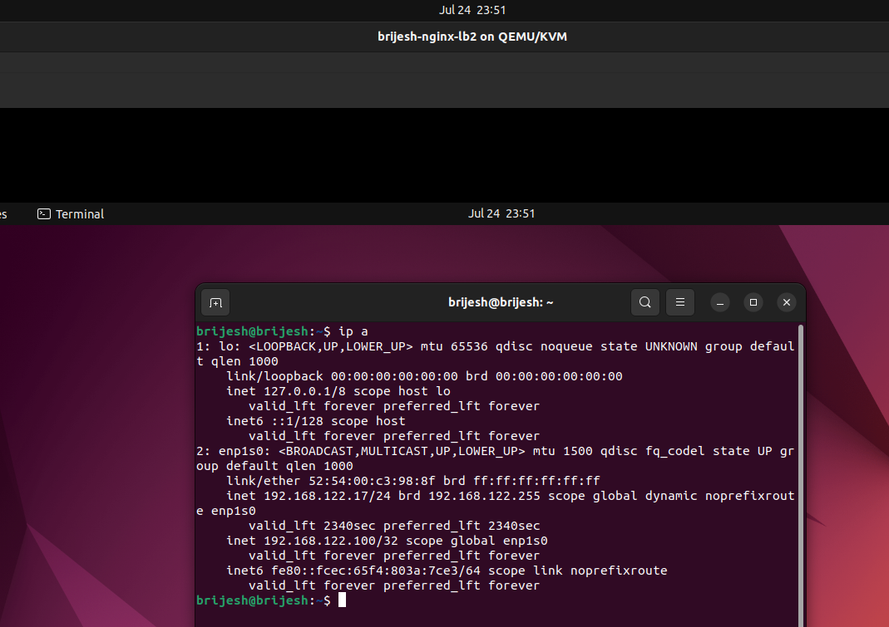
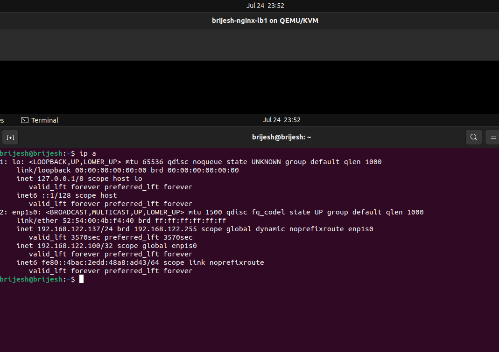

# NGINX Assignment

## Title
Set Up an HA Reverse Proxy with Load Balancing and Web Hosting

---

## Overview

This assignment simulates a production-like High Availability (HA) environment using **NGINX** and **Keepalived**. It demonstrates how to:

- Deploy backend web servers serving different content.
- Deploy frontend load balancers using NGINX reverse proxy and round-robin load balancing.
- Implement high availability using Keepalived with VRRP and a floating Virtual IP (VIP).

> **Assumption:** All nodes are on the same subnet and can reach each other.

---

## Node Details



Set up 3 VMs with **Ubuntu 22.04 LTS**:

- **1 VM** for **2 web servers**
- **2 VMs** for separate load balancers: **LB1** and **LB2**

---

## Backend Web Servers (on VM1 using Podman containers)

### Web Server 1

```bash
podman run -d --name node-a-nginx --network host \
  -v ~/node-a/html:/usr/share/nginx/html:ro \
  -v ~/node-a/conf/nginx.conf:/etc/nginx/nginx.conf:ro \
  docker.io/library/nginx:alpine
```

#### nginx.conf


```nginx
events {}

http {
    server {
        listen 8081;
        location / {
            root /usr/share/nginx/html;
            index index.html;
        }
    }
}
```


---

### Web Server 2

```bash
podman run -d --name node-b-nginx --network host \
  -v ~/node-b/html:/usr/share/nginx/html:ro \
  -v ~/node-b/conf/nginx.conf:/etc/nginx/nginx.conf:ro \
  docker.io/library/nginx:alpine
```

#### nginx.conf

```nginx
events {}

http {
    server {
        listen 8082;
        location / {
            root /usr/share/nginx/html;
            index index.html;
        }
    }
}
```

---

### Output using `curl`

- Node A (192.168.122.240:8081): **Backend Server 1**
- Node B (192.168.122.240:8082): **Backend Server 2**


---

## Load Balancer Nodes (LB Tier)

- **LB1:** 192.168.122.17  
- **LB2:** 192.168.122.137  
- **VIP (Keepalived):** 192.168.122.100

### NGINX Setup (same for LB1 and LB2)

```bash
sudo apt install -y nginx
```

#### `/etc/nginx/sites-available/default` (or custom conf)

```nginx
upstream backend {
    server 192.168.122.240:8081;
    server 192.168.122.240:8082;
}

server {
    listen 80;
    location / {
        proxy_pass http://backend;
        proxy_set_header Host $host;
        proxy_set_header X-Real-IP $remote_addr;
        proxy_set_header X-Forwarded-For $proxy_add_x_forwarded_for;
        proxy_set_header X-Forwarded-Proto $scheme;
        proxy_next_upstream error timeout invalid_header http_500 http_502 http_503 http_504;
    }
}
```


### Remove Default Site and Reload NGINX

```bash
sudo rm /etc/nginx/sites-enabled/default
sudo systemctl reload nginx
```

---

## Keepalived Configuration

### Installation

```bash
sudo apt install keepalived -y
```

---

### LB1 - Master Node `/etc/keepalived/keepalived.conf`

```ini
vrrp_instance VI_1 {
    state MASTER
    interface enp1s0
    virtual_router_id 51
    priority 150
    advert_int 1
    authentication {
        auth_type PASS
        auth_pass secret123
    }
    virtual_ipaddress {
        192.168.122.100
    }
}
```

```bash
sudo systemctl enable --now keepalived
```

---

### LB2 - Backup Node `/etc/keepalived/keepalived.conf`

```ini
vrrp_instance VI_1 {
    state BACKUP
    interface enp1s0
    virtual_router_id 51
    priority 100
    advert_int 1
    authentication {
        auth_type PASS
        auth_pass boss123
    }
    virtual_ipaddress {
        192.168.122.100
    }
}
```

```bash
sudo systemctl enable --now keepalived
```

---

## Testing Instructions

### 1. Test VIP & Load Balancing

```bash
curl http://192.168.122.100
```

Repeat multiple times to verify round-robin output:

- Backend Server 1
- Backend Server 2




---

### 2. Simulate Failover

On **LB1**:

```bash
sudo systemctl stop keepalived
```


Check `ip a` on **LB2** to ensure VIP has been taken over.



---

### 3. Recovery

On **LB1**:

```bash
sudo systemctl start keepalived
```

VIP should fail back to **LB1** due to higher priority.


---

## Output Example

```bash
curl http://192.168.122.100
# Output: Backend Server 1

curl http://192.168.122.100
# Output: Backend Server 2
```

---

## VIP Before & After Failover

- **Before Failover:** VIP on LB1 (192.168.122.100)
- **After Failover:** VIP shifts to LB2

---

## Conclusion

This assignment demonstrates a highly available web architecture using:

- **NGINX** as reverse proxy and load balancer
- **Podman** containers for backend nodes
- **Keepalived** for VRRP-based failover and VIP management

It effectively simulates real-world redundancy and load balancing across a multi-tier deployment.
